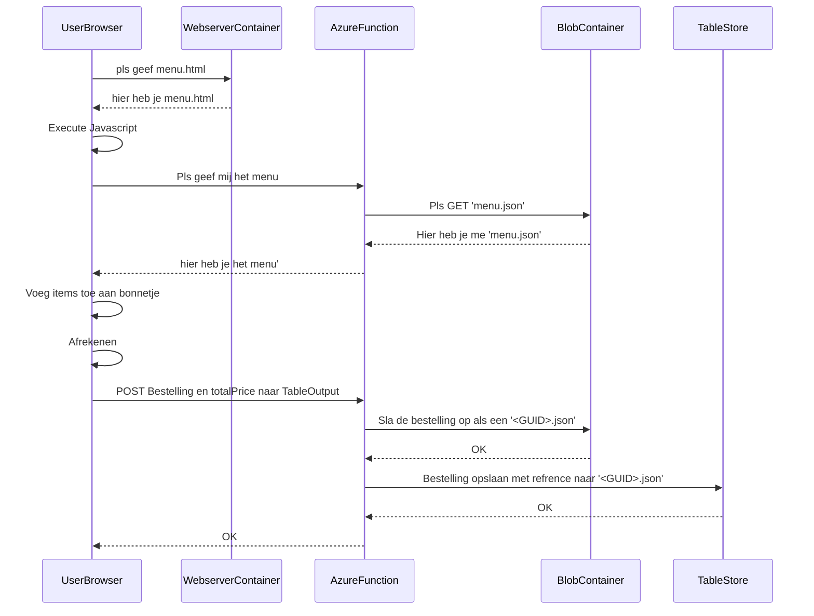

## GEWENSTE SITUATIE

```mermaid
sequenceDiagram
    UserBrowser->>WebserverContainer: pls geef menu.html
    WebserverContainer-->>UserBrowser: hier heb je menu.html
    UserBrowser->>UserBrowser: Execute Javascript
    UserBrowser->>AzureFunction: Pls geef mij het menu
    AzureFunction->>BlobContainer: Pls GET 'menu.json'
    BlobContainer-->> AzureFunction: Hier heb je me 'menu.json'
    AzureFunction-->>UserBrowser: hier heb je het menu'
    UserBrowser->>UserBrowser: Voeg items toe aan bonnetje
    UserBrowser->>UserBrowser: Afrekenen
    UserBrowser->>AzureFunction: POST Bestelling en totalPrice naar TableOutput
    AzureFunction->>BlobContainer: Sla de bestelling op als een '<GUID>.json'
    BlobContainer-->>AzureFunction: OK
    AzureFunction->>TableStore: Bestelling opslaan met refrence naar '<GUID>.json'
    TableStore-->> AzureFunction: OK
    AzureFunction-->>UserBrowser: OK

```
## AZURE FUNCTION BIJ TWEEDE REQUEST NIET AANWEZIG